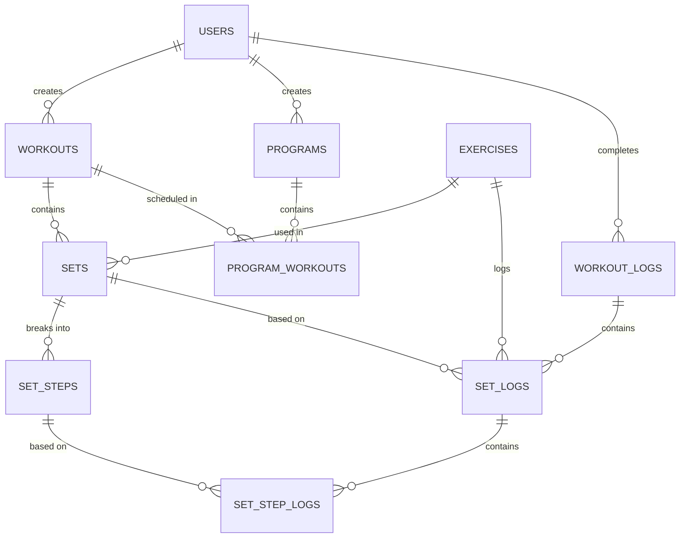

# Fitness Application Database Schema Design

## Overview
This document outlines the first draft database schema for the fitness workout application. The design focuses on flexibility, scalability, and proper normalization while supporting core fitness tracking functionality.

### Key Terminology
- **Workout**: A template/plan containing exercises, shared by creator with other users
- **Set**: An exercise entry in a workout with configuration for how many times to perform it
- **SetStep**: Individual weight/rep segment within a set (enables drop sets, pyramids, etc.)
- **WorkoutLog**: A completed workout session by a user
- **SetLog**: One physical execution of an exercise in a completed workout (1 of N planned times)
- **SetStepLog**: The actual reps/weight a user achieved for one step during a SetLog

## Entity Relationship Diagram



## Core Tables

### Users
Stores user account information with Auth0 integration.
```
- user_id (UUID, PK)
- auth0_sub (VARCHAR, UNIQUE) - Auth0 subject identifier
- email (VARCHAR, UNIQUE)
- first_name (VARCHAR)
- last_name (VARCHAR)
- created_at (TIMESTAMP)
- updated_at (TIMESTAMP)
```

**Notes:**
- `auth0_sub` is the key Auth0 integration point for authentication
- Email is unique for both Auth0 and application usage
- No password storage (Auth0 handles all auth)

---

## Example: Drop Set Configuration

To illustrate the SetSteps design, here's a concrete example:

**Planned Workout Structure:**
```
Workout: "Chest Day"
├─ Set (set_order=1): Bench Press (num_sets=3)
│  ├─ SetStep (step_order=1): 6 reps @ 155 lbs
│  └─ SetStep (step_order=2): 4 reps @ 185 lbs (drop set)
└─ Rest: 90 seconds between repetitions of this set
```

**Logged Completion:**
```
WorkoutLog: "Chest Day" completed by user at 2025-02-13 10:00 AM

SetLog 1 (set_number=1):
├─ SetStepLog 1: Completed 6 reps @ 155 lbs in 45 seconds
└─ SetStepLog 2: Completed 4 reps @ 185 lbs in 30 seconds, rested 90 seconds

SetLog 2 (set_number=2):
├─ SetStepLog 1: Completed 6 reps @ 155 lbs in 46 seconds  
└─ SetStepLog 2: Completed 3 reps @ 185 lbs in 28 seconds, rested 90 seconds

SetLog 3 (set_number=3):
├─ SetStepLog 1: Completed 5 reps @ 155 lbs in 42 seconds (fatigue)
└─ SetStepLog 2: Completed 3 reps @ 185 lbs in 25 seconds, rested 90 seconds
```

**Key Points:**
- User performed the same 2-step set 3 times as planned
- SetSteps define the template (6@155, 4@185)
- SetStepLogs capture actual performance (which varied slightly across the 3 sets)
- This structure supports any progressive pattern (pyramids, wave loading, etc.)

---
Master list of all exercises available in the system.
```
- exercise_id (UUID, PK)
- name (VARCHAR, UNIQUE)
- description (TEXT)
- equipment_required (JSON) - Array of equipment needed
- primary_muscle_group (VARCHAR) - e.g., "chest", "back", "legs"
- difficulty_level (VARCHAR) - "beginner", "intermediate", "advanced"
- instructions (TEXT)
- created_at (TIMESTAMP)
- updated_at (TIMESTAMP)
```

**Notes:**
- Master data table - exercises are reusable across workouts
- Equipment stored as JSON array for flexibility (e.g., `["barbell", "bench"]`)
- Consider: Could split muscle_groups into separate table if complex querying needed

---

### Workouts
Full workout templates created by users.
```
- workout_id (UUID, PK)
- creator_id (UUID, FK -> Users)
- name (VARCHAR)
- description (TEXT)
- is_shared (BOOLEAN) - Whether other users can see/use this workout
- created_at (TIMESTAMP)
- updated_at (TIMESTAMP)
```

**Notes:**
- Workouts are reusable templates
- Can be shared publicly or kept private
- Creator is tracked for ownership/permissions

---

### Sets
Individual exercise entries within a workout (maps exercise to workout).
```
- set_id (UUID, PK)
- workout_id (UUID, FK -> Workouts)
- set_order (INT) - Order within the workout (1, 2, 3...)
- exercise_id (UUID, FK -> Exercises)
- num_sets (INT) - Number of times to perform this exercise (e.g., 3 for "3x10")
- rest_seconds (INT) - Rest time between sets
- notes (TEXT)
- created_at (TIMESTAMP)
- updated_at (TIMESTAMP)
```

**Notes:**
- A "Set" in the database represents one exercise entry in a workout
- `num_sets` is the count of how many times the user performs this exercise configuration
- The actual rep/weight progression is defined in SetSteps (see below)
- Each actual set performed is logged separately in SetLogs

---

### SetSteps
Individual rep/weight segments within a set configuration (supports progressive loading).
```
- set_step_id (UUID, PK)
- set_id (UUID, FK -> Sets)
- step_order (INT) - Order within the set (1, 2, 3...)
- planned_reps (INT) - Target reps for this step
- planned_weight (DECIMAL) - Weight in lbs/kg for this step
- created_at (TIMESTAMP)
- updated_at (TIMESTAMP)
```

**Notes:**
- Allows drop sets, pyramids, wave loading, and progressive patterns **within** a single set
- Example: Set with `num_sets=3`, with 2 steps each:
  - Set Step 1: 6 reps @ 155 lbs
  - Set Step 2: 4 reps @ 185 lbs
  - User performs this 3 times total
- Supports any weight/rep combination per step
- Composite index on `(set_id, step_order)` recommended

---

### Programs
Organized groups of workouts forming complete strength programs.
```
- program_id (UUID, PK)
- creator_id (UUID, FK -> Users)
- name (VARCHAR)
- description (TEXT)
- is_shared (BOOLEAN)
- duration_weeks (INT) - How many weeks is this program
- created_at (TIMESTAMP)
- updated_at (TIMESTAMP)
```

**Notes:**
- Programs group workouts into structured plans
- Can span multiple weeks with periodization
- Programs are templates that can be assigned to users

---

### ProgramWorkouts
Many-to-many mapping of workouts to programs with scheduling.
```
- program_id (UUID, FK -> Programs)
- workout_id (UUID, FK -> Workouts)
- week_number (INT) - Which week (1 to duration_weeks)
- day_of_week (INT) - 0-6 (0=Monday or Sunday - clarify convention)
- is_rest_day (BOOLEAN) - If true, no workout scheduled
- created_at (TIMESTAMP)
- PRIMARY KEY (program_id, week_number, day_of_week)
```

**Notes:**
- Implements the many-to-many relationship between Programs and Workouts
- Supports weekly periodization and rest day management
- Allows same workout to appear on different days in same/different weeks
- Composite PK prevents duplicate week/day entries

---

## Logging Tables

### WorkoutLogs
Top-level record of a completed workout session.
```
- workout_log_id (UUID, PK)
- user_id (UUID, FK -> Users)
- original_workout_id (UUID, FK -> Workouts, NULLABLE)
- program_id (UUID, FK -> Programs, NULLABLE) - If part of a program
- start_time (TIMESTAMP)
- end_time (TIMESTAMP)
- total_duration_minutes (INT) - end_time - start_time
- notes (TEXT)
- created_at (TIMESTAMP)
```

**Notes:**
- Allows tracking custom workouts (original_workout_id can be null)
- Times enable tracking workout duration
- Links back to program if completed as part of one

---

### SetLogs
Individual execution of a set during a workout (tracks each physical set performed).
```
- set_log_id (UUID, PK)
- workout_log_id (UUID, FK -> WorkoutLogs)
- original_set_id (UUID, FK -> Sets, NULLABLE)
- set_order (INT) - Order of the exercise in the workout
- exercise_id (UUID, FK -> Exercises)
- set_number (INT) - Which occurrence (1st, 2nd, 3rd of num_sets)
- created_at (TIMESTAMP)
```

**Notes:**
- One row per physical set performed in a workout
- Links to WorkoutLogs for session context
- Split into SetLogs and SetStepLogs for granular tracking (see below)

---

### SetStepLogs
Individual step execution within a completed set (logs actual reps/weight per step).
```
- set_step_log_id (UUID, PK)
- set_log_id (UUID, FK -> SetLogs)
- original_set_step_id (UUID, FK -> SetSteps, NULLABLE)
- step_order (INT) - Order within the set
- completed_reps (INT) - Actual reps performed
- completed_weight (DECIMAL) - Actual weight used
- completed_time_seconds (INT) - Time to complete this step
- rest_time_after_seconds (INT) - Rest taken after this step (before next step)
- notes (TEXT)
- created_at (TIMESTAMP)
```

**Notes:**
- One row per step within a physical set
- Allows full flexibility: user can deviate from planned reps/weight per step
- `original_set_step_id` nullable for ad-hoc/custom steps during workout
- Composite index on `(set_log_id, step_order)` recommended

---

## Many-to-Many Mappings

### ProgramWorkouts (covered above)
Maps workouts to programs with timing/scheduling.

### User-Program Assignments (Future consideration)
If users will be "assigned" to programs (vs. just viewing them):
```
- user_id (UUID, FK -> Users)
- program_id (UUID, FK -> Programs)
- start_date (DATE)
- end_date (DATE, NULLABLE)
- is_completed (BOOLEAN)
- PRIMARY KEY (user_id, program_id, start_date)
```

---

## Design Decisions & Rationale

### IDs
- Using UUID instead of auto-increment for distributed system compatibility
- Supports potential horizontal scaling

### Auth0 Integration
- `auth0_sub` is the unique identifier from Auth0
- All user authentication/authorization handled by Auth0
- Application manages authorization only

### Nullable ForeignKeys in Logs
- `original_workout_id` and `original_set_id` nullable to support custom/ad-hoc workouts
- User can deviate from planned workout during logging

### Progressive Loading via SetSteps
- Introduced `SetSteps` table to support drop sets, pyramids, wave loading, and other progressive patterns
- A single workout "set" (e.g., "Bench Press 3x") has multiple steps, each with its own reps/weight
- Example configuration:
  - **Set**: Bench Press, 3 times (num_sets=3)
    - **Step 1**: 6 reps @ 155 lbs
    - **Step 2**: 4 reps @ 185 lbs
  - User performs this 3-step sequence 3 times total
- Maintains flexibility for custom ad-hoc weights during actual logging via `SetStepLogs`

### Logging Granularity
- Two-level logging: `SetLogs` for the physical set, `SetStepLogs` for individual steps
- Allows detailed performance tracking without over-complicating the planned structure
- Users can modify weight/reps on the fly during a workout

### Program Scheduling
- `ProgramWorkouts` allows complex periodization
- Rest days tracked explicitly
- Supports different workouts on same day_of_week in different weeks

### Logging Structure
- Flat logs (WorkoutLog + SetLog) for query efficiency
- No separate ExerciseLog table (exercise_id stored in SetLog)
- Avoids over-normalization while maintaining flexibility

---

## Future Considerations

1. **Equipment Table**: If equipment becomes complex, create dedicated table
2. **Muscle Group Table**: Normalize muscle groups for better querying/filtering
3. **Exercise Variations**: Track exercise families (Barbell vs Dumbbell bench press)
4. **User Profiles**: Add bio, profile picture, public stats, PRs
5. **Social Features**: Following, workout sharing, community programs
6. **Injury/Notes**: Track injuries, form cues, progression notes
7. **Wearable Integration**: Track heart rate, calories during workouts
8. **Nutrition**: Separate meals/macros tracking (may be separate bounded context)
9. **RPE/Difficulty**: Track perceived exertion or difficulty rating per set

---

## Implementation Notes

- Create all tables with proper indexing on ForeignKeys
- Consider soft deletes for audit trail (add `deleted_at` timestamp)
- Add unique constraints on user emails and exercise names
- Implement optimistic locking if concurrent edits expected
