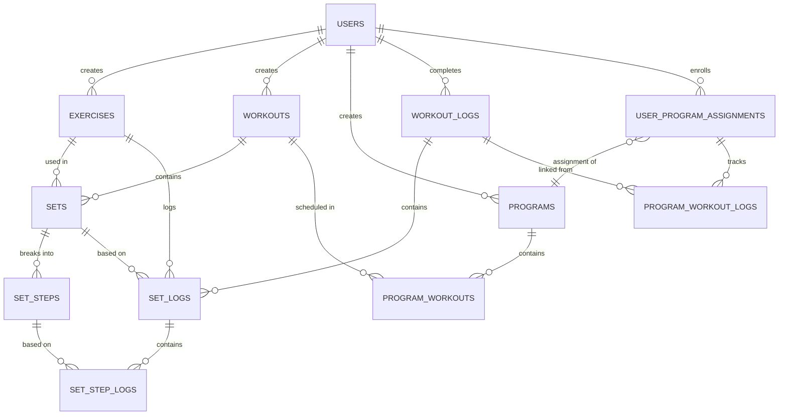

# Fitness Application Database Schema Design

## Overview
This document defines the database schema for the fitness workout application. The design focuses on flexibility, scalability, and proper normalization while supporting core fitness tracking, program management, and progress tracking.

**Total tables: 12** (10 original + UserProgramAssignments + ProgramWorkoutLogs)

### Key Terminology
- **Workout**: A template/plan containing exercises, shared by creator with other users
- **Set**: An exercise entry in a workout with configuration for how many times to perform it
- **SetStep**: Individual weight/rep segment within a set (enables drop sets, pyramids, etc.)
- **WorkoutLog**: A completed workout session by a user
- **SetLog**: One physical execution of an exercise in a completed workout (1 of N planned times)
- **SetStepLog**: The actual reps/weight a user achieved for one step during a SetLog
- **UserProgramAssignment**: A user's enrollment in a specific program
- **ProgramWorkoutLog**: Completion status of a single scheduled workout within a program assignment

## Entity Relationship Diagram


```mermaid
erDiagram
    USERS ||--o{ EXERCISES : creates
    USERS ||--o{ WORKOUTS : creates
    USERS ||--o{ PROGRAMS : creates
    USERS ||--o{ WORKOUT_LOGS : completes
    USERS ||--o{ USER_PROGRAM_ASSIGNMENTS : enrolls

    EXERCISES ||--o{ SETS : "used in"
    WORKOUTS ||--o{ SETS : contains
    SETS ||--o{ SET_STEPS : "breaks into"

    PROGRAMS ||--o{ PROGRAM_WORKOUTS : contains
    WORKOUTS ||--o{ PROGRAM_WORKOUTS : "scheduled in"

    USER_PROGRAM_ASSIGNMENTS }o--|| PROGRAMS : "assignment of"
    USER_PROGRAM_ASSIGNMENTS ||--o{ PROGRAM_WORKOUT_LOGS : tracks

    WORKOUT_LOGS ||--o{ SET_LOGS : contains
    WORKOUT_LOGS ||--o{ PROGRAM_WORKOUT_LOGS : "linked from"
    SETS ||--o{ SET_LOGS : "based on"
    EXERCISES ||--o{ SET_LOGS : logs

    SET_LOGS ||--o{ SET_STEP_LOGS : contains
    SET_STEPS ||--o{ SET_STEP_LOGS : "based on"
```

---

## Core Tables

### Users
Stores user account information with Auth0 integration.
```
- user_id (UUID, PK)
- auth0_sub (VARCHAR, UNIQUE) — Auth0 subject identifier
- email (VARCHAR, UNIQUE)
- first_name (VARCHAR)
- last_name (VARCHAR)
- created_at (TIMESTAMP)
- updated_at (TIMESTAMP)
```

**Notes:**
- `auth0_sub` is the key Auth0 integration point for authentication
- Email is unique for both Auth0 and application usage
- No password storage (Auth0 handles all auth)

---

### Exercises
Master list of all exercises available in the system.
```
- exercise_id (UUID, PK)
- creator_id (UUID, FK -> Users, NULLABLE) — NULL = system/admin-seeded
- name (VARCHAR, UNIQUE)
- description (TEXT)
- equipment_required (JSON) — Array of equipment needed
- primary_muscle_group (VARCHAR) — e.g., "chest", "back", "legs"
- difficulty_level (VARCHAR) — "beginner", "intermediate", "advanced"
- instructions (TEXT)
- deleted_at (TIMESTAMP, NULLABLE) — Soft delete
- created_at (TIMESTAMP)
- updated_at (TIMESTAMP)
```

**Notes:**
- Master data table — exercises are reusable across workouts
- `creator_id = NULL` means system/admin-seeded exercise (not owned by any user)
- Non-null `creator_id` means user-created; only modifiable/deletable by creator or admin
- All exercises (system and user-created) are **visible to everyone**
- Equipment stored as JSON array for flexibility (e.g., `["barbell", "bench"]`)
- FK uses `ON DELETE SET NULL` — if creator is deleted, exercise becomes system-owned
- Soft deleted exercises remain in the database for log integrity

---

### Workouts
Full workout templates created by users.
```
- workout_id (UUID, PK)
- creator_id (UUID, FK -> Users)
- name (VARCHAR)
- description (TEXT)
- is_shared (BOOLEAN) — Whether other users can see/use this workout
- deleted_at (TIMESTAMP, NULLABLE) — Soft delete
- created_at (TIMESTAMP)
- updated_at (TIMESTAMP)
```

**Notes:**
- Workouts are reusable templates
- Can be shared publicly or kept private
- Creator is tracked for ownership/permissions
- Soft deleted workouts remain for log integrity (logs reference `original_workout_id`)

---

### Sets
Individual exercise entries within a workout (maps exercise to workout).
```
- set_id (UUID, PK)
- workout_id (UUID, FK -> Workouts)
- set_order (INT) — Order within the workout (1, 2, 3...)
- exercise_id (UUID, FK -> Exercises)
- num_sets (INT) — Number of times to perform this exercise (e.g., 3 for "3x10")
- rest_seconds (INT) — Rest time between sets
- notes (TEXT)
- created_at (TIMESTAMP)
- updated_at (TIMESTAMP)
```

**Notes:**
- A "Set" in the database represents one exercise entry in a workout
- `num_sets` is the count of how many times the user performs this exercise configuration
- The actual rep/weight progression is defined in SetSteps (see below)
- Each actual set performed is logged separately in SetLogs
- Cascade deletes with parent Workout (no separate soft delete needed)

---

### SetSteps
Individual rep/weight segments within a set configuration (supports progressive loading).
```
- set_step_id (UUID, PK)
- set_id (UUID, FK -> Sets)
- step_order (INT) — Order within the set (1, 2, 3...)
- planned_reps (INT) — Target reps for this step
- planned_weight (DECIMAL) — Weight in lbs/kg for this step
- created_at (TIMESTAMP)
- updated_at (TIMESTAMP)
```

**Notes:**
- Allows drop sets, pyramids, wave loading, and progressive patterns **within** a single set
- Example: Set with `num_sets=3`, with 2 steps each:
  - Set Step 1: 6 reps @ 155 lbs
  - Set Step 2: 4 reps @ 185 lbs
  - User performs this 2-step sequence 3 times total
- Supports any weight/rep combination per step
- Cascade deletes with parent Set
- Composite unique index on `(set_id, step_order)`

---

### Programs
Organized groups of workouts forming complete strength programs.
```
- program_id (UUID, PK)
- creator_id (UUID, FK -> Users)
- name (VARCHAR)
- description (TEXT)
- is_shared (BOOLEAN)
- duration_weeks (INT) — How many weeks is this program
- deleted_at (TIMESTAMP, NULLABLE) — Soft delete
- created_at (TIMESTAMP)
- updated_at (TIMESTAMP)
```

**Notes:**
- Programs group workouts into structured plans
- Can span multiple weeks with periodization
- Programs are templates that can be assigned to users via UserProgramAssignments
- Soft deleted programs remain for assignment/log integrity

---

### ProgramWorkouts
Many-to-many mapping of workouts to programs with scheduling.
```
- program_id (UUID, FK -> Programs)
- workout_id (UUID, FK -> Workouts, NULLABLE)
- week_number (INT) — Which week (1 to duration_weeks)
- day_of_week (INT) — 0-6 (0=Sunday, 6=Saturday)
- is_rest_day (BOOLEAN) — If true, no workout scheduled
- created_at (TIMESTAMP)
- PRIMARY KEY (program_id, week_number, day_of_week)
```

**Notes:**
- Implements the many-to-many relationship between Programs and Workouts
- Supports weekly periodization and rest day management
- Allows same workout to appear on different days in same/different weeks
- Composite PK prevents duplicate week/day entries
- Check constraint enforces: rest_day ↔ workout_id IS NULL

---

## Program Enrollment & Progress Tables

### UserProgramAssignments
Tracks a user's enrollment in a training program.
```
- assignment_id (UUID, PK)
- user_id (UUID, FK -> Users)
- program_id (UUID, FK -> Programs)
- start_date (DATE)
- status (VARCHAR) — 'active', 'completed', 'paused', 'abandoned'
- current_week (INT, DEFAULT 1) — User's current position in the program
- current_day_of_week (INT, DEFAULT 0) — User's current day position
- completed_at (TIMESTAMP, NULLABLE)
- created_at (TIMESTAMP)
- updated_at (TIMESTAMP)
- UNIQUE (user_id, program_id, start_date)
```

**Notes:**
- A user can re-start the same program (different `start_date`)
- `current_week` + `current_day_of_week` track where the user left off
- Status lifecycle: `active` → `completed` | `paused` | `abandoned`
- When status = `completed`, `completed_at` is populated
- Paused assignments can be resumed (status back to `active`)
- FK to Programs uses `ON DELETE NO ACTION` — can't delete a program with active assignments

### ProgramWorkoutLogs
Tracks completion of each scheduled workout within a program assignment.
```
- program_workout_log_id (UUID, PK)
- assignment_id (UUID, FK -> UserProgramAssignments)
- week_number (INT) — Which week in the program schedule
- day_of_week (INT) — Which day (0-6)
- workout_log_id (UUID, FK -> WorkoutLogs, NULLABLE) — Linked when completed
- status (VARCHAR) — 'pending', 'completed', 'skipped'
- scheduled_date (DATE, NULLABLE) — Actual calendar date for this slot
- completed_at (TIMESTAMP, NULLABLE)
- notes (NVARCHAR)
- created_at (TIMESTAMP)
- updated_at (TIMESTAMP)
- UNIQUE (assignment_id, week_number, day_of_week)
```

**Notes:**
- One row per scheduled workout slot from the program schedule
- Created when user starts a program assignment (pre-populated from ProgramWorkouts)
- `workout_log_id` is NULL until the user actually completes the workout
- When completed, links to the actual WorkoutLog record
- **Progress calculation**: `COUNT(status='completed') / COUNT(*)` for an assignment
- Scheduled dates are calculated from `assignment.start_date` + week/day offsets
- Cascade deletes with parent UserProgramAssignment

---

## Logging Tables

### WorkoutLogs
Top-level record of a completed workout session.
```
- workout_log_id (UUID, PK)
- user_id (UUID, FK -> Users)
- original_workout_id (UUID, FK -> Workouts, NULLABLE)
- program_id (UUID, FK -> Programs, NULLABLE) — If part of a program
- start_time (TIMESTAMP)
- end_time (TIMESTAMP, NULLABLE)
- total_duration_minutes (COMPUTED) — DATEDIFF(MINUTE, start_time, end_time)
- notes (TEXT)
- created_at (TIMESTAMP)
```

**Notes:**
- Allows tracking custom/ad-hoc workouts (original_workout_id can be null)
- Times enable tracking workout duration
- Links back to program if completed as part of one
- Logs are **never soft-deleted** — they are permanent historical records

---

### SetLogs
Individual execution of a set during a workout (tracks each physical set performed).
```
- set_log_id (UUID, PK)
- workout_log_id (UUID, FK -> WorkoutLogs)
- original_set_id (UUID, FK -> Sets, NULLABLE)
- set_order (INT) — Order of the exercise in the workout
- exercise_id (UUID, FK -> Exercises)
- set_number (INT) — Which occurrence (1st, 2nd, 3rd of num_sets)
- created_at (TIMESTAMP)
```

**Notes:**
- One row per physical set performed in a workout
- Links to WorkoutLogs for session context
- `original_set_id` nullable for ad-hoc/custom sets during workout

---

### SetStepLogs
Individual step execution within a completed set (logs actual reps/weight per step).
```
- set_step_log_id (UUID, PK)
- set_log_id (UUID, FK -> SetLogs)
- original_set_step_id (UUID, FK -> SetSteps, NULLABLE)
- step_order (INT) — Order within the set
- completed_reps (INT) — Actual reps performed
- completed_weight (DECIMAL) — Actual weight used
- completed_time_seconds (INT) — Time to complete this step
- rest_time_after_seconds (INT) — Rest taken after this step
- notes (TEXT)
- created_at (TIMESTAMP)
```

**Notes:**
- One row per step within a physical set
- Allows full flexibility: user can deviate from planned reps/weight per step
- `original_set_step_id` nullable for ad-hoc/custom steps during workout

---

## Example: Drop Set Configuration

**Planned Workout Structure:**
```
Workout: "Chest Day"
├─ Set (set_order=1): Bench Press (num_sets=3)
│  ├─ SetStep (step_order=1): 6 reps @ 155 lbs
│  └─ SetStep (step_order=2): 4 reps @ 185 lbs (drop set)
└─ Rest: 90 seconds between repetitions of this set
```

**Logged Completion:**
```
WorkoutLog: "Chest Day" completed by user at 2025-02-13 10:00 AM

SetLog 1 (set_number=1):
├─ SetStepLog 1: Completed 6 reps @ 155 lbs in 45 seconds
└─ SetStepLog 2: Completed 4 reps @ 185 lbs in 30 seconds, rested 90 seconds

SetLog 2 (set_number=2):
├─ SetStepLog 1: Completed 6 reps @ 155 lbs in 46 seconds
└─ SetStepLog 2: Completed 3 reps @ 185 lbs in 28 seconds, rested 90 seconds

SetLog 3 (set_number=3):
├─ SetStepLog 1: Completed 5 reps @ 155 lbs in 42 seconds (fatigue)
└─ SetStepLog 2: Completed 3 reps @ 185 lbs in 25 seconds, rested 90 seconds
```

---

## Example: Program Assignment & Progress Tracking

**Program Setup:**
```
Program: "Beginner Strength" (4 weeks)
├─ Week 1
│  ├─ Monday: "Upper Body A"
│  ├─ Wednesday: "Lower Body A"
│  └─ Friday: "Full Body"
├─ Week 2
│  ├─ Monday: "Upper Body B"
│  ├─ Wednesday: "Lower Body B"
│  └─ Friday: "Full Body"
└─ Weeks 3-4: (repeat pattern)
```

**Assignment Flow:**
```
1. User enrolls → UserProgramAssignment created (status=active, start_date=2026-03-03)
2. ProgramWorkoutLogs pre-populated: 12 entries (3 days × 4 weeks), all status=pending
3. User completes "Upper Body A" → Creates WorkoutLog, links to ProgramWorkoutLog (week=1, day=1)
4. ProgramWorkoutLog updated: status=completed, workout_log_id set, completed_at set
5. Progress: 1/12 = 8.3%
6. User skips Wednesday → ProgramWorkoutLog for (week=1, day=3) set to status=skipped
7. Progress: 2/12 = 16.7% (1 completed + 1 skipped counted toward progress)
```

---

## Design Decisions & Rationale

### IDs
- Using UUID instead of auto-increment for distributed system compatibility
- Supports potential horizontal scaling

### Auth0 Integration
- `auth0_sub` is the unique identifier from Auth0
- All user authentication handled by Auth0
- Application manages authorization (ownership checks, admin roles)

### Exercise Ownership
- `creator_id = NULL` → system/admin-seeded exercise, immutable by regular users
- `creator_id = <user_id>` → user-created, only modifiable/deletable by creator or admin
- All exercises are visible to all authenticated users regardless of creator
- FK uses `ON DELETE SET NULL` so exercises survive creator account deletion

### Soft Deletes
- Applied to content tables: **Exercises**, **Workouts**, **Programs**
- `deleted_at = NULL` means active; non-null means soft-deleted
- **Not applied** to: Users, Sets, SetSteps (cascade with parent), ProgramWorkouts (cascade), logs (permanent records)
- Soft-deleted records remain for referential integrity (logs reference them)
- All list queries should filter `WHERE deleted_at IS NULL`
- Filtered indexes on `DeletedAt IS NULL` for query performance

### Nullable Foreign Keys in Logs
- `original_workout_id` and `original_set_id` nullable to support custom/ad-hoc workouts
- User can deviate from planned workout during logging

### Progressive Loading via SetSteps
- `SetSteps` table supports drop sets, pyramids, wave loading, and other progressive patterns
- A single workout "set" (e.g., "Bench Press 3x") has multiple steps, each with its own reps/weight
- Maintains flexibility for custom ad-hoc weights during actual logging via `SetStepLogs`

### Program Assignment & Progress
- Two-table design: `UserProgramAssignments` (enrollment) + `ProgramWorkoutLogs` (per-slot tracking)
- Pre-populating ProgramWorkoutLogs on assignment creation enables progress calculation without complex joins
- Users can re-start programs (unique on user_id + program_id + start_date)
- Progress is a simple count query on ProgramWorkoutLogs filtered by assignment_id

### Logging Structure
- Flat logs (WorkoutLog → SetLog → SetStepLog) for query efficiency
- No separate ExerciseLog table (exercise_id stored in SetLog)
- Logs are never deleted — permanent historical records

---

## Indexing Strategy

### Primary Key Indexes (automatic)
Every table has a UUID PK with a clustered index.

### Foreign Key Indexes
All FK columns have non-clustered indexes for join performance.

### Composite Indexes
| Table | Index | Purpose |
|-------|-------|---------|
| Sets | `(workout_id, set_order)` UNIQUE | Order enforcement |
| SetSteps | `(set_id, step_order)` UNIQUE | Order enforcement |
| SetStepLogs | `(set_log_id, step_order)` UNIQUE | Order enforcement |
| SetLogs | `(workout_log_id, set_order, set_number)` | Log ordering |
| WorkoutLogs | `(user_id, start_time DESC)` | User history queries |
| UserProgramAssignments | `(user_id, status)` | Active program lookup |
| ProgramWorkoutLogs | `(assignment_id, status)` | Progress queries |

### Filtered Indexes (WHERE DeletedAt IS NULL)
| Table | Index | Purpose |
|-------|-------|---------|
| Exercises | `Active_MuscleGroup` | Exercise browsing |
| Exercises | `Active_CreatorId` | "My exercises" queries |
| Workouts | `Active_CreatorId` | "My workouts" queries |
| Workouts | `Active_Shared` | Shared workout browsing |
| Programs | `Active_CreatorId` | "My programs" queries |
| Programs | `Active_Shared` | Shared program browsing |

---

## Future Considerations

1. **Admin Roles**: Add role column to Users (or Auth0 RBAC) for admin exercise/content management
2. **Equipment Table**: If equipment becomes complex, create dedicated table
3. **Muscle Group Table**: Normalize muscle groups for better querying/filtering
4. **Exercise Variations**: Track exercise families (Barbell vs Dumbbell bench press)
5. **User Profiles**: Add bio, profile picture, public stats, PRs
6. **Social Features**: Following, workout sharing, community programs
7. **Injury/Notes**: Track injuries, form cues, progression notes
8. **Wearable Integration**: Track heart rate, calories during workouts
9. **Nutrition**: Separate meals/macros tracking (may be separate bounded context)
10. **RPE/Difficulty**: Track perceived exertion or difficulty rating per set

---

## Implementation Notes

- All migrations are idempotent (IF NOT EXISTS checks)
- Soft deletes implemented on content tables (Exercises, Workouts, Programs)
- Filtered indexes used for active-record queries to avoid scanning deleted rows
- Optimistic locking can be added via `updated_at` comparison if concurrent edits are expected
- Log tables use `ON DELETE NO ACTION` for FK references to preserve history
